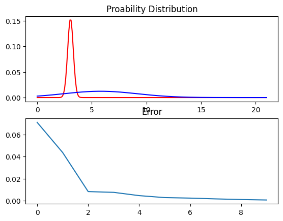
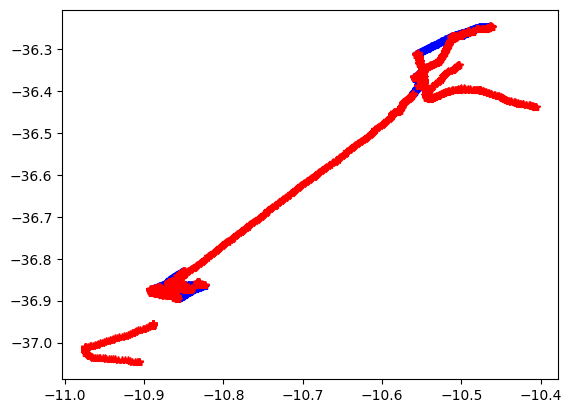

# Boat Path Classification

This is a pet project of mine that had the objective of push myself into learning HMM after had seeing a little of it in my pattern recognition class. 

## Results

By inputing the fishing boat date that i had, i could extract the following probability distribution. The red gaussian symbolizes the probability of the boat being fishing if it's in that range of velocity. The blue one if he cruzing. 

By using this date, we could classify the whole path trajectory of fishing boat.

